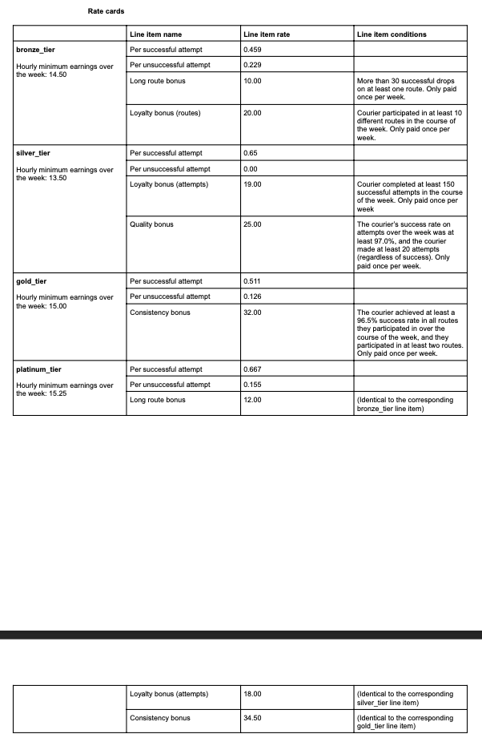

# Relay BE Assignment

## Project Description
In order to align incentives for Relay and for our couriers, we’re implementing a pay per delivery attempt earnings model for couriers. This means that couriers are compensated for every parcel they deliver, subject to minimum hourly earning guarantees and other targeted incentives.
We’d like you to write and deploy a stateless API endpoint that takes a courier’s activity log documenting their Relay activity over the course of a week. The endpoint should return a structured earnings statement. The activity log should be transformed into the earnings statement according to a rate card.


## Table of Contents
1. [Technologies Used](#technologies-used)
2. [Installation](#installation)
3. [Testing](#testing)
4. [Public Deployment Endpoint](public-deployment-endpoint)
5. [Examples](#examples)

## Technologies Used
- Python
- Docker
- Flask
- Pandas
- Pytest
- Shell

## Installation
1. Clone the repository: `git clone https://github.com/AbhayKD/Relay-be-assignment`
2. Run make file: `docker-compose up`

## Testing 
To run tests, use the following command:

```pytest test/```
or
```docker-compose up test```

## Public Deployment Endpoint

https://relay-courier-api.onrender.com/

## Examples 

## Get list of Things

### Request

`GET /health_check/`

    curl -i -H 'Accept: application/json'  https://relay-courier-api.onrender.com/health_check

### Response

    ```{"message":"All AOK!"}```

## Get Rate Card Earning

### Request

`POST /earning/{rate_card_id}`

    curl -i -H 'Accept: application/json' -d '[{"route_id":"RT5QHQ6M3A937H","attempt_date_time":"2023-12-18T08:33:18.588934+00:00","success":true},{"route_id":"RT5QHQ6M3A937H","attempt_date_time":"2023-12-18T08:37:11.897203+00:00","success":true},{"route_id":"RT5QHQ6M3A937H","attempt_date_time":"2023-12-18T08:39:10.938613+00:00","success":true},{"route_id":"RT5QHQ6M3A937H","attempt_date_time":"2023-12-18T08:43:14.747595+00:00","success":false},{"route_id":"RT5QHQ6M3A937H","attempt_date_time":"2023-12-18T08:45:45.375317+00:00","success":true},{"route_id":"RT5QHQ6M3A937H","attempt_date_time":"2023-12-18T08:45:58.396736+00:00","success":true}]' [http://localhost:7000/thing](https://relay-courier-api.onrender.com/earning/platinum_tier)

### Response

    ```{
    "line_items": [
        {
            "name": "Per successful attempt",
            "quantity": 5.0,
            "rate": 0.667,
            "total": 3.335
        },
        {
            "name": "Per unsuccessful attempt",
            "quantity": 1.0,
            "rate": 0.155,
            "total": 0.155
        },
        {
            "name": "Long route bonus",
            "quantity": 0,
            "rate": 12.0,
            "total": 0.0
        },
        {
            "name": "Loyalty Bonus (attempts)",
            "quantity": 0,
            "rate": 19.0,
            "total": 0.0
        },
        {
            "name": "Consistency Bonus",
            "quantity": 0,
            "rate": 32.0,
            "total": 0.0
        }
    ],
    "line_item_subtotal": 3.4899999999999998,
    "hours_worked": 0.2110577227777778,
    "minimum_earnings": 3.218630272361111,
    "final_earnings": 3.4899999999999998
}```
